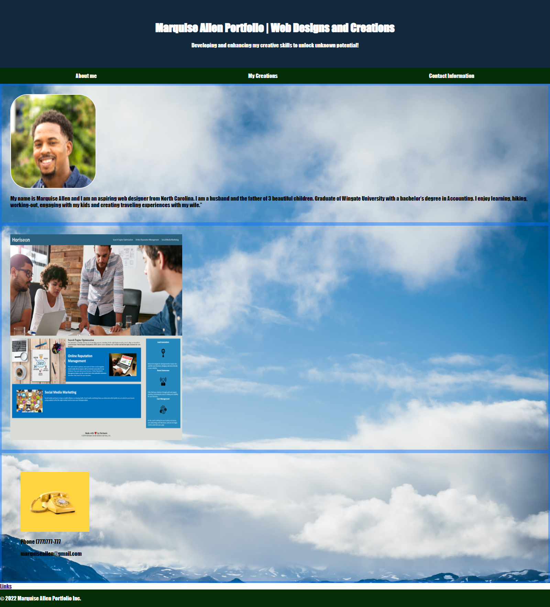

# marquise-design-portfolio

## Description

In this project we create a web application from scratch.  Building a portfolio page to add to my arsenal of projects.   Utilizing skills we used such as flexbox, media queries and css variable to meet the Acceptance Criteria. 
I added semantic values to the tags within the HTML file, so that our own site is optimized for search engines.  
Tested displays for style and functionality.  

## Resources
[Git Hub Repo](https://github.com/FocusKing/marquise-design-portfolio)

[LIVE SITE](https://focusking.github.io/marquise-design-portfolio/)

## Table of Contents 

- [Usage](#usage)
- [Visuals](#visuals)
- [Tests](#tests)

## Usage
A portfolio of work can showcase your skills and talents to employers looking to fill a part-time or full-time position.  Highlight strengths, showcase skills and allow people to learn a little more about myself.

## Visuals

## Tests

As an employee completing the assignment given by a marketing agency
I created  a codebase that follows accessibility standards
so that our own site is optimized for search engines.
Utilized the inspect tool to dissect the site and check for any errors. 